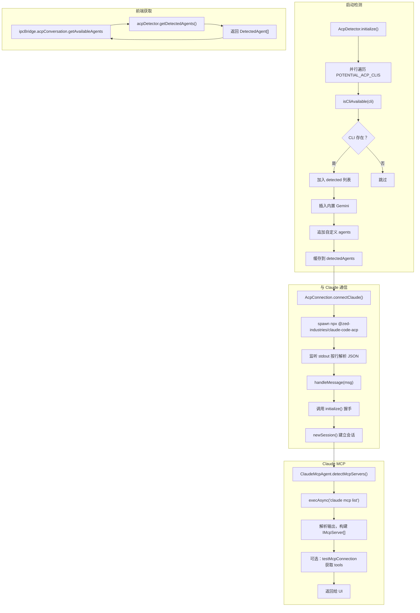

# AION UI

Github: [iOfficeAI/AionUi](https://github.com/iOfficeAI/AionUi)

# 检测多个 CLI 并与 Claude 通信的实现

## 概要

AionUi 在启动时通过 `AcpDetector` 并行检测本地已安装的多个 CLI（如 Claude、Qwen、Goose 等），检测到后通过 `AcpConnection` 以 stdio + JSON-RPC 与 CLI 进程通信，并通过 IPC 桥将可用代理列表暴露给前端；以 Claude 为例，还支持 MCP 服务器的自动检测与安装。

## 关键流程



## 1）多 CLI 并行检测

- `AcpDetector.initialize()` 在启动时执行一次，使用 `Promise.allSettled` 并行检测 `POTENTIAL_ACP_CLIS` 中的每个 CLI [1](#0-0) 。
- `isCliAvailable` 先用 `which/where`，Windows 下失败时回退到 `Get-Command`，确保能识别 shim（如 claude.ps1） [2](#0-1) 。
- 检测到至少一个 ACP 工具时，会在列表头部插入内置 Gemini，并追加用户配置的自定义 agents [3](#0-2) 。

## 2）与 Claude CLI 通信（以 Claude 为例）

- `AcpConnection.connectClaude` 使用 `npx` 直接运行 `@zed-industries/claude-code-acp`，避免打包依赖问题 [4](#0-3) 。
- 通过 `stdio` 读写：子进程 stdout 按行解析 JSON-RPC 消息，调用 `handleMessage` 处理；随后发送 `initialize` 与 `newSession` 完成握手与会话建立 [5](#0-4) 。

## 3）将检测结果暴露给前端

- `acpConversationBridge.getAvailableAgents` IPC provider 直接调用 `acpDetector.getDetectedAgents()` 返回缓存结果 [6](#0-5) 。
- 前端 Hook `useMultiAgentDetection` 在应用启动时调用该接口，若检测到多个 ACP 智能体则提示用户进入多代理模式 [7](#0-6) 。

## 4）Claude MCP 服务器检测与安装（示例）

- `ClaudeMcpAgent.detectMcpServers` 执行 `claude mcp list`，解析输出并构建 `IMcpServer` 列表；对已连接服务器可调用 `testMcpConnection` 获取其 tools [8](#0-7) 。
- `installMcpServers` 使用 `claude mcp add -s user` 将 MCP 服务器安装到用户作用域，确保全局可用 [9](#0-8) 。

## Notes

- 检测器为全局单例，启动时运行一次，后续通过 `getDetectedAgents()` 获取缓存结果。
- 与 Claude 的通信基于 JSON-RPC over stdio，其他 CLI（如 Qwen、Goose）也遵循相同 ACP 协议，仅启动参数不同（见 `ACP_BACKENDS_ALL` 的 `acpArgs`） [10](#0-9) 。
- MCP 检测由 `McpService` 协调，按 backend 分发到对应 Agent（如 `ClaudeMcpAgent`）执行 [11](#0-10) 。

Wiki pages you might want to explore:

- [Overview (iOfficeAI/AionUi)](/wiki/iOfficeAI/AionUi#1)

### Citations

**File:** src/agent/acp/AcpDetector.ts (L72-138)

```typescript
  async initialize(): Promise<void> {
    if (this.isDetected) return;

    console.log('[ACP] Starting agent detection...');
    const startTime = Date.now();

    const isWindows = process.platform === 'win32';
    const whichCommand = isWindows ? 'where' : 'which';

    const isCliAvailable = (cliCommand: string): boolean => {
      // Keep original behavior: prefer where/which, then fallback on Windows to Get-Command.
      // 保持原逻辑：优先使用 where/which，Windows 下失败再回退到 Get-Command。
      try {
        execSync(`${whichCommand} ${cliCommand}`, {
          encoding: 'utf-8',
          stdio: 'pipe',
          timeout: 1000,
        });
        return true;
      } catch {
        if (!isWindows) return false;
      }

      if (isWindows) {
        try {
          // PowerShell fallback for shim scripts like claude.ps1 (vfox)
          // PowerShell 回退，支持 claude.ps1 这类 shim（例如 vfox）
          execSync(`powershell -NoProfile -NonInteractive -Command "Get-Command -All ${cliCommand} | Select-Object -First 1 | Out-Null"`, {
            encoding: 'utf-8',
            stdio: 'pipe',
            timeout: 1000,
          });
          return true;
        } catch {
          return false;
        }
      }

      return false;
    };

    const detected: DetectedAgent[] = [];

    // 并行检测所有潜在的 ACP CLI
    const detectionPromises = POTENTIAL_ACP_CLIS.map((cli) => {
      return Promise.resolve().then(() => {
        if (!isCliAvailable(cli.cmd)) {
          return null;
        }

        return {
          backend: cli.backendId,
          name: cli.name,
          cliPath: cli.cmd,
          acpArgs: cli.args,
        };
      });
    });

    const results = await Promise.allSettled(detectionPromises);

    // 收集检测结果
    for (const result of results) {
      if (result.status === 'fulfilled' && result.value) {
        detected.push(result.value);
      }
    }
```

**File:** src/agent/acp/AcpDetector.ts (L140-151)

```typescript
// 如果检测到ACP工具，添加内置Gemini
if (detected.length > 0) {
  detected.unshift({
    backend: "gemini",
    name: "Gemini CLI",
    cliPath: undefined,
    acpArgs: undefined,
  });
}

// Check for custom agents configuration - insert after claude if found
await this.addCustomAgentsToList(detected);
```

**File:** src/agent/acp/AcpConnection.ts (L133-157)

```typescript
  private async connectClaude(workingDir: string = process.cwd()): Promise<void> {
    // Use NPX to run Claude Code ACP bridge directly from npm registry
    // This eliminates dependency packaging issues and simplifies deployment
    console.error('[ACP] Using NPX approach for Claude ACP bridge');

    // Clean environment
    const cleanEnv = { ...process.env };
    delete cleanEnv.NODE_OPTIONS;
    delete cleanEnv.NODE_INSPECT;
    delete cleanEnv.NODE_DEBUG;

    // Use npx to run the Claude ACP bridge directly from npm registry
    const isWindows = process.platform === 'win32';
    const spawnCommand = isWindows ? 'npx.cmd' : 'npx';
    const spawnArgs = ['@zed-industries/claude-code-acp'];

    this.child = spawn(spawnCommand, spawnArgs, {
      cwd: workingDir,
      stdio: ['pipe', 'pipe', 'pipe'],
      env: cleanEnv,
      shell: isWindows,
    });

    await this.setupChildProcessHandlers('claude');
  }
```

**File:** src/agent/acp/AcpConnection.ts (L192-221)

```typescript
// Handle messages from ACP server
let buffer = "";
this.child.stdout?.on("data", (data) => {
  const dataStr = data.toString();
  buffer += dataStr;
  const lines = buffer.split("\n");
  buffer = lines.pop() || "";

  for (const line of lines) {
    if (line.trim()) {
      try {
        const message = JSON.parse(line) as AcpMessage;
        // console.log('AcpMessage==>', JSON.stringify(message));
        this.handleMessage(message);
      } catch (error) {
        // Ignore parsing errors for non-JSON messages
      }
    }
  }
});

// Initialize protocol with timeout
await Promise.race([
  this.initialize(),
  new Promise((_, reject) =>
    setTimeout(() => {
      reject(new Error("Initialize timeout after 60 seconds"));
    }, 60000),
  ),
]);
```

**File:** src/process/bridge/acpConversationBridge.ts (L34-45)

```typescript
// 新的ACP检测接口 - 基于全局标记位
ipcBridge.acpConversation.getAvailableAgents.provider(() => {
  try {
    const agents = acpDetector.getDetectedAgents();
    return Promise.resolve({ success: true, data: agents });
  } catch (error) {
    return Promise.resolve({
      success: false,
      msg: error instanceof Error ? error.message : "Unknown error",
    });
  }
});
```

**File:** src/renderer/hooks/useMultiAgentDetection.tsx (L14-34)

```typescript
  useEffect(() => {
    const checkMultiAgentMode = async () => {
      try {
        const response = await ipcBridge.acpConversation.getAvailableAgents.invoke();
        if (response && response.success && response.data) {
          // 检测是否有多个ACP智能体（不包括内置的Gemini）
          const acpAgents = response.data.filter((agent: { backend: string; name: string; cliPath?: string }) => agent.backend !== 'gemini');
          if (acpAgents.length > 1) {
            // message.success({
            //   content: (
            //     <div style={{ lineHeight: '1.5' }}>
            //       <div style={{ fontWeight: 'bold', marginTop: '4px' }}>{t('conversation.welcome.multiAgentModeEnabled')}</div>
            //     </div>
            //   ),
            //   duration: 3000,
            //   showIcon: false,
            //   className: 'multi-agent-message',
            // });
            message.success(t('conversation.welcome.multiAgentModeEnabled'));
          }
        }
```

**File:** src/process/services/mcpServices/agents/ClaudeMcpAgent.ts (L31-129)

```typescript
  detectMcpServers(_cliPath?: string): Promise<IMcpServer[]> {
    const detectOperation = async () => {
      try {
        // 使用Claude Code CLI命令获取MCP配置
        const { stdout: result } = await execAsync('claude mcp list', {
          timeout: this.timeout,
          env: { ...process.env, NODE_OPTIONS: '' }, // 清除调试选项，避免调试器附加
        });

        // 如果没有配置任何MCP服务器，返回空数组
        if (result.includes('No MCP servers configured') || !result.trim()) {
          return [];
        }

        // 解析文本输出
        const mcpServers: IMcpServer[] = [];
        const lines = result.split('\n');

        for (const line of lines) {
          // 清除 ANSI 颜色代码 (支持多种格式)
          /* eslint-disable no-control-regex */
          const cleanLine = line
            .replace(/\u001b\[[0-9;]*m/g, '')
            .replace(/\[[0-9;]*m/g, '')
            .trim();
          /* eslint-enable no-control-regex */

          // 查找格式如: "12306-mcp: npx -y 12306-mcp - ✓ Connected" 或 "12306-mcp: npx -y 12306-mcp - ✗ Failed to connect"
          // 支持多种状态文本
          const match = cleanLine.match(/^([^:]+):\s+(.+?)\s*-\s*[✓✗]\s*(.+)$/);
          if (match) {
            const [, name, commandStr, statusText] = match;
            const commandParts = commandStr.trim().split(/\s+/);
            const command = commandParts[0];
            const args = commandParts.slice(1);

            // 解析状态：Connected, Disconnected, Failed to connect, 等
            const isConnected = statusText.toLowerCase().includes('connected') && !statusText.toLowerCase().includes('disconnect');
            const status = isConnected ? 'connected' : 'disconnected';

            // 构建transport对象
            const transportObj = {
              type: 'stdio' as const,
              command: command,
              args: args,
              env: {},
            };

            // 尝试获取tools信息（对所有已连接的服务器）
            let tools: Array<{ name: string; description?: string }> = [];
            if (isConnected) {
              try {
                const testResult = await this.testMcpConnection(transportObj);
                tools = testResult.tools || [];
              } catch (error) {
                console.warn(`[ClaudeMcpAgent] Failed to get tools for ${name.trim()}:`, error);
                // 如果获取tools失败，继续使用空数组
              }
            }

            mcpServers.push({
              id: `claude_${name.trim()}`,
              name: name.trim(),
              transport: transportObj,
              tools: tools,
              enabled: true,
              status: status,
              createdAt: Date.now(),
              updatedAt: Date.now(),
              description: '',
              originalJson: JSON.stringify(
                {
                  mcpServers: {
                    [name.trim()]: {
                      command: command,
                      args: args,
                      description: `Detected from Claude CLI`,
                    },
                  },
                },
                null,
                2
              ),
            });
          }
        }

        console.log(`[ClaudeMcpAgent] Detection complete: found ${mcpServers.length} server(s)`);
        return mcpServers;
      } catch (error) {
        console.warn('[ClaudeMcpAgent] Failed to detect MCP servers:', error);
        return [];
      }
    };

    // 使用命名函数以便在日志中显示
    Object.defineProperty(detectOperation, 'name', { value: 'detectMcpServers' });
    return this.withLock(detectOperation);
  }
```

**File:** src/process/services/mcpServices/agents/ClaudeMcpAgent.ts (L134-185)

```typescript
  installMcpServers(mcpServers: IMcpServer[]): Promise<McpOperationResult> {
    const installOperation = async () => {
      try {
        for (const server of mcpServers) {
          if (server.transport.type === 'stdio') {
            // 使用Claude Code CLI添加MCP服务器到user scope（全局配置）
            // AionUi是全局工具，MCP配置应该对所有项目可用
            // 格式: claude mcp add -s user <name> <command> -- [args...] [env_options]
            const envArgs = Object.entries(server.transport.env || {})
              .map(([key, value]) => `-e ${key}=${value}`)
              .join(' ');

            let command = `claude mcp add -s user "${server.name}" "${server.transport.command}"`;

            // 如果有参数或环境变量，使用 -- 分隔符
            if (server.transport.args?.length || Object.keys(server.transport.env || {}).length) {
              command += ' --';
              if (server.transport.args?.length) {
                // 对每个参数进行适当的引用，防止包含特殊字符的参数被误解析
                const quotedArgs = server.transport.args.map((arg: string) => `"${arg}"`).join(' ');
                command += ` ${quotedArgs}`;
              }
            }

            // 环境变量在 -- 之后添加
            if (envArgs) {
              command += ` ${envArgs}`;
            }

            try {
              await execAsync(command, {
                timeout: 5000,
                env: { ...process.env, NODE_OPTIONS: '' }, // 清除调试选项，避免调试器附加
              });
              console.log(`[ClaudeMcpAgent] Added MCP server: ${server.name}`);
            } catch (error) {
              console.warn(`Failed to add MCP ${server.name} to Claude Code:`, error);
              // 继续处理其他服务器，不要因为一个失败就停止
            }
          } else {
            console.warn(`Skipping ${server.name}: Claude CLI only supports stdio transport type`);
          }
        }
        return { success: true };
      } catch (error) {
        return { success: false, error: error instanceof Error ? error.message : String(error) };
      }
    };

    Object.defineProperty(installOperation, 'name', { value: 'installMcpServers' });
    return this.withLock(installOperation);
  }
```

**File:** src/types/acpTypes.ts (L279-377)

```typescript
// 所有后端配置 - 包括暂时禁用的 / All backend configurations - including temporarily disabled ones
export const ACP_BACKENDS_ALL: Record<AcpBackendAll, AcpBackendConfig> = {
  claude: {
    id: "claude",
    name: "Claude Code",
    cliCommand: "claude",
    authRequired: true,
    enabled: true,
    supportsStreaming: false,
  },
  gemini: {
    id: "gemini",
    name: "Google CLI",
    cliCommand: "gemini",
    authRequired: true,
    enabled: false,
    supportsStreaming: true,
  },
  qwen: {
    id: "qwen",
    name: "Qwen Code",
    cliCommand: "qwen",
    defaultCliPath: "npx @qwen-code/qwen-code",
    authRequired: true,
    enabled: true, // ✅ 已验证支持：Qwen CLI v0.0.10+ 支持 --experimental-acp
    supportsStreaming: true,
  },
  iflow: {
    id: "iflow",
    name: "iFlow CLI",
    cliCommand: "iflow",
    authRequired: true,
    enabled: true,
    supportsStreaming: false,
  },
  codex: {
    id: "codex",
    name: "Codex ",
    cliCommand: "codex",
    authRequired: false,
    enabled: true, // ✅ 已验证支持：Codex CLI v0.4.0+ 支持 acp 模式
    supportsStreaming: false,
  },
  goose: {
    id: "goose",
    name: "Goose",
    cliCommand: "goose",
    authRequired: false,
    enabled: true, // ✅ Block's Goose CLI，使用 `goose acp` 启动
    supportsStreaming: false,
    acpArgs: ["acp"], // goose 使用子命令而非 flag
  },
  auggie: {
    id: "auggie",
    name: "Augment Code",
    cliCommand: "auggie",
    authRequired: false,
    enabled: true, // ✅ Augment Code CLI，使用 `auggie --acp` 启动
    supportsStreaming: false,
    acpArgs: ["--acp"], // auggie 使用 --acp flag
  },
  kimi: {
    id: "kimi",
    name: "Kimi CLI",
    cliCommand: "kimi",
    authRequired: false,
    enabled: true, // ✅ Kimi CLI (Moonshot)，使用 `kimi acp` 启动
    supportsStreaming: false,
    acpArgs: ["acp"], // kimi 使用 acp 子命令
  },
  opencode: {
    id: "opencode",
    name: "OpenCode",
    cliCommand: "opencode",
    authRequired: false,
    enabled: true, // ✅ OpenCode CLI，使用 `opencode acp` 启动
    supportsStreaming: false,
    acpArgs: ["acp"], // opencode 使用 acp 子命令
  },
  droid: {
    id: "droid",
    name: "Factory Droid",
    cliCommand: "droid",
    // Droid uses FACTORY_API_KEY from environment, not an interactive auth flow.
    authRequired: false,
    enabled: true, // ✅ Factory docs: `droid exec --output-format acp` (JetBrains/Zed ACP integration)
    supportsStreaming: false,
    acpArgs: ["exec", "--output-format", "acp"],
  },
  custom: {
    id: "custom",
    name: "Custom Agent",
    cliCommand: undefined, // User-configured via settings
    authRequired: false,
    enabled: true,
    supportsStreaming: false,
  },
};
```

**File:** src/process/services/mcpServices/McpService.ts (L83-148)

```typescript
  async getAgentMcpConfigs(
    agents: Array<{
      backend: AcpBackend;
      name: string;
      cliPath?: string;
    }>
  ): Promise<DetectedMcpServer[]> {
    // 创建完整的检测列表，包含 ACP agents 和额外的 MCP-only agents
    const allAgentsToCheck = [...agents];

    // 检查是否需要添加原生 Gemini CLI（如果它不在 ACP agents 中）
    const hasNativeGemini = agents.some((a) => a.backend === 'gemini' && a.cliPath === 'gemini');
    if (!hasNativeGemini) {
      // 检查系统中是否安装了原生 Gemini CLI
      try {
        if (!this.isCliAvailable('gemini')) {
          throw new Error('gemini not found');
        }

        // 如果找到了原生 Gemini CLI，添加到检测列表
        allAgentsToCheck.push({
          backend: 'gemini' as AcpBackend,
          name: 'Google Gemini CLI',
          cliPath: 'gemini',
        });
        console.log('[McpService] Added native Gemini CLI for MCP detection');
      } catch {
        // 原生 Gemini CLI 未安装，跳过
      }
    }

    // 并发执行所有agent的MCP检测
    const promises = allAgentsToCheck.map(async (agent) => {
      try {
        // 跳过 fork 的 Gemini（backend='gemini' 且 cliPath=undefined）
        // fork 的 Gemini 的 MCP 配置应该由 AionuiMcpAgent 管理
        if (agent.backend === 'gemini' && !agent.cliPath) {
          console.log(`[McpService] Skipping fork Gemini (ACP only, MCP managed by AionuiMcpAgent)`);
          return null;
        }

        const agentInstance = this.getAgent(agent.backend);
        if (!agentInstance) {
          console.warn(`[McpService] No agent instance for backend: ${agent.backend}`);
          return null;
        }

        const servers = await agentInstance.detectMcpServers(agent.cliPath);
        console.log(`[McpService] Detected ${servers.length} MCP servers for ${agent.backend} (cliPath: ${agent.cliPath || 'default'})`);

        if (servers.length > 0) {
          return {
            source: agent.backend as McpSource,
            servers,
          };
        }
        return null;
      } catch (error) {
        console.warn(`[McpService] Failed to detect MCP servers for ${agent.backend}:`, error);
        return null;
      }
    });

    const results = await Promise.all(promises);
    return results.filter((result): result is DetectedMcpServer => result !== null);
  }
```
